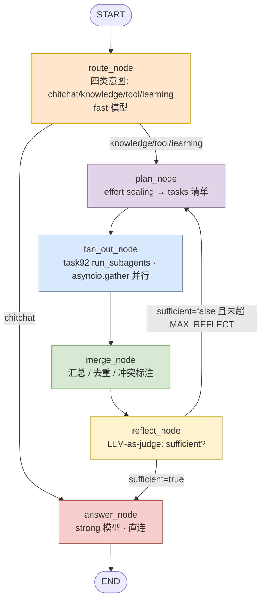

# task24 AI 助手 LangGraph 图拓扑（route→plan→fan-out→merge→reflect→answer）

> 建模产物（mermaid skill）｜对应实现 `edu-agent/app/ai/graph.py`
> 编排：Starting Point → route →（chitchat 直连 | plan→fan-out→merge→reflect→answer）

## 0. 图概览（Mermaid）



## 1. 状态（AgentState）

| 字段 | 类型/Reducer | 说明 |
|------|------|------|
| messages | `list[BaseMessage]`（add_messages） | 对话历史，节点间自动追加 |
| user_id / session_id | int / str\|None | **真实用户上下文**（service 注入，禁止兜底默认 1） |
| intent | str | chitchat / knowledge / tool / learning |
| effort | str | L0~L3 保守判定 |
| tasks | `list[dict]` | plan 产出子代理任务清单 `{subagent, objective, input}` |
| subagent_results | `list[dict]` | fan-out 后主 state 合并的蒸馏摘要（≤SUBAGENT_SUMMARY_BUDGET） |
| merged_context | str | merge 后的综合上下文 |
| reflect_count | int | LLM-as-judge 轮数 |
| sufficient | bool | judge 判定；false 回 plan 再检索 |
| final_answer | str | answer_node 产出 |
| degraded_reason | str\|None | 降级说明（llm_failed / reflect_max_iter） |
| nodes_executed | `list[str]` | 已执行节点 trace（随 checkpoint 持久化，供 durable execution 验证） |

## 2. 节点明细

| 节点 | 函数 | 模型 | 职责 / 健壮性 |
|------|------|------|------|
| **route** | `route_node` | fast | 四类意图分类，白名单校验，非法回退 knowledge；失败默认 knowledge |
| — | `route_gate` | — | 条件边：chitchat → answer（1 次 fast 直连）；其余 → plan |
| **plan** | `plan_node` | — | 按 intent 产出 tasks；effort scaling：knowledge→L1(2)/tool,learning→L2(3)/兜底→L1(1) |
| **fan_out** | `fan_out_node` | fast×N | **task92 run_subagents** 并行（独立上下文 + asyncio.gather）；工具服务按 user_id/thread_id 闭包绑定；主 state 只收蒸馏摘要 |
| **merge** | `merge_node` | — | 汇总/去重/冲突标注；空摘要兜底文案 |
| **reflect** | `reflect_node` | fast | LLM-as-judge sufficient?；达 MAX_REFLECT_ITERATIONS 强制放行标 reflect_max_iter |
| — | `reflect_gate` | — | sufficient=true → answer；false → plan 再 fan-out |
| **answer** | `answer_node` | strong | 整合 merged_context + 历史 → 最终回答；strong 失败降级 fast → 兜底 llm_failed |

## 3. 边与 gate

```
START → route
route --chitchat--- > answer
route --else------ > plan
plan --> fan_out --> merge --> reflect
reflect --sufficient--- > answer
reflect --insufficient/再试--> plan
answer --> END
```

## 4. durable execution（GWT②）

- 编译：`build_graph().compile(checkpointer=PlainRedisSaver(settings.REDIS_URL))`。
- 本环境 Redis(6379) 为原生 Redis，无 RediSearch 模块，LangGraph 自带 `AsyncRedisSaver`（redisvl 向量索引）无法建索引；
  故用自定义 [checkpoint_redis.py](file:///E:/stu/project/stu/EduAgent实施手册/edu-agent/app/ai/checkpoint_redis.py)（继承 InMemorySaver + 逐线程 pickle 快照落 Redis `edu:ckpt:{thread_id}`）。
- 同一 `thread_id` 任意时刻中断，进程 kill 后用同 thread_id 重新 `ainvoke`，从最近 checkpoint 续跑，
  `nodes_executed` 随 checkpoint 持久化 → **不重复执行已完成节点**。
- Redis 不可用：`_make_checkpointer` 返回 None，降级为无 checkpoint 图（本地打靶不阻塞）。

## 5. effort scaling（GWT③ 并行）

- 多任务 plan 由 `fan_out_node` 用 task92 `run_subagents`（内部 `asyncio.gather` + `return_exceptions=True`）**并行**执行，
  总耗时 ≈ max(单任务)，非 sum。
- 每子代理独立 messages 会话、独立 system/tool 白名单/maxTurns；结果只回 ≤SUBMAGENT_SUMMARY_BUDGET 蒸馏摘要 + artifact 引用。

## 6. 安全（GWT③ user_id 真实）

- `service.py` 由请求注入真实 `user_id`；`_empty_state` 写入 `state.user_id`。
- `fan_out_node` 直接 `int(state["user_id"])`（**禁止兜底默认 1**，缺失即报错，防越权根因）。
- `grep` 审计：`app/ai/graph.py` / `app/ai/subagents/` **无 `user_id=1` 硬编码** ✅