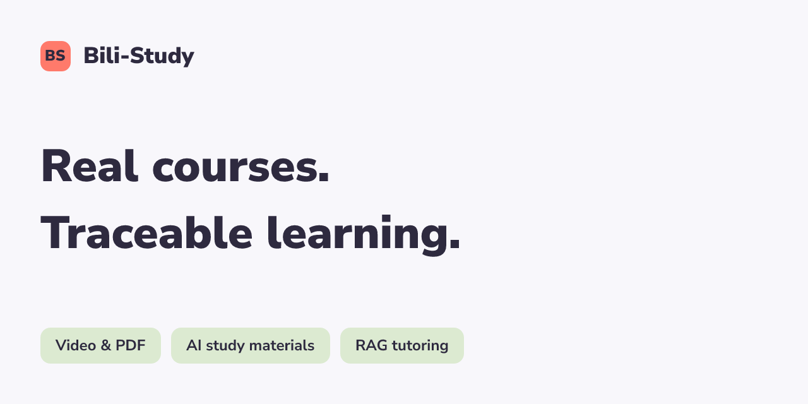

<h1 align="center">Bili-Study</h1>

<p align="center">把真实课程与 PDF 变成有来源、可回看、可提问的学习资料。</p>

<p align="center"></p>

Bili-Study 是面向学生和教师的 AI 学习系统。教师在现有管理页面导入本地视频、Bilibili 链接或 PDF；系统生成学习资料并进入既有 RAG，学生可以播放、阅读、练习和基于来源提问。

它把原始媒体、派生资料和正式发布版本分别管理：**视频能播放，不代表 AI 资料已经允许学生使用。** 只有 READY 版本成为正式视频知识，新版本失败时保留旧版和原视频。

## 核心能力

| 能力 | 使用者得到什么 |
|---|---|
| 视频知识生产 | 原生字幕 / ASR → 总结、AI 笔记、章节、时间戳字幕、树状思维导图与课次练习 |
| 课程学习与 Tutor | 正常报名后看课、点章节或引用回到视频时间点；问答限制在授权课次与正式版本 |
| 文档 RAG | 管理员上传 PDF，通过 MinerU、Document IR 与 BGE-M3 / Milvus进入同一知识体系 |
| 可解释的执行链 | 普通 Chat 的 LangGraph / Harness 与课程 Tutor 分支分别可观测，Jaeger 展示真实 Trace |
| 学习闭环 | 学生题库入口、作答判分、解析、错题重做和学习进度；历史课程是否有题依实际绑定 |

## 架构

```text
 Teacher / Student
        |
        v
 Next.js pages --------> FastAPI (auth, courses, chat, video tasks)
                                |
         Video / PDF -----------+
              |                 |
        Transcript / MinerU     |   StudyContext / Course Tutor
              |                 |             ^
        Artifact / Document IR  |             |
              |                 v             |
        BGE-M3 ----------> Existing Milvus RAG +
              |
        Neo4j projection       MySQL: tasks + READY authority
                               MinIO: source + derived artifacts
                               Redis: queues + context + locks
                               MongoDB: events + side storage
                               OpenTelemetry / Jaeger: traces
```

[系统上下文、服务与存储、生产流程交互图](docs/architecture/README.md) · [当前模块职责](docs/ARCHITECTURE.md)

LangGraph 的九节点中，六个核心节点由 SixNodeHarness 实现；问候可能短路、反思可以循环。课程 Tutor 使用经服务端授权的 StudyContext 分支，**不等于每次提问都运行全部九节点**。Neo4j 为关联投影和可选检索扩展，不取代主 RAG。

## 使用示例

管理员上传仓库提供的 [缓存课堂 PDF](bili-study-frontend/public/samples/bili-study-cache-lab-20261007.pdf)，学生提问：「这份课堂练习设定的 TTL 是多少秒？为什么仅靠 TTL 不能保证一致性？」

2026-10-07 实机链路完成 MinerU 解析、Milvus 入库和学生问答，答案准确引用材料中的 **37 秒**。这是课堂任意练习参数，不是行业标准或性能指标。[完整操作说明与实际页面](docs/DEMO.md)。


## 快速安装

当前发布重点是源码与已验证的本地运行方式。需要 **Python 3.11、uv、Node.js 22 或更新版本、npm、ffmpeg / ffprobe**，以及配置好的 MySQL、Milvus、MongoDB、Redis、MinIO、Neo4j、BGE-M3 / reranker 模型和 OpenAI-compatible 模型 API。MinerU 使用独立环境；源文件、模型权重、Cookie、数据库和密钥均不随源码提供。

```powershell
git clone https://github.com/qq2743759880/EduAgent-Implementation.git Bili-Study
cd Bili-Study
uv sync --project bili-study-agent --locked --extra cpu --no-dev
cd bili-study-frontend
npm ci
cd ..
Copy-Item bili-study-agent/.env.example bili-study-agent/.env
```

在私有 `.env` 填写自己的存储地址、凭据、模型路径和 LLM 配置，生成随机 JWT_SECRET 和 API_TOKEN。连接已有实例时必须沿用相同 BGE-M3 模型与业务 schema，不通过启动脚本重建数据库。GPU 环境选 `--extra gpu`，不能同时启用 cpu / gpu。

## 快速开始

已配置的 Windows 本地实例从根目录启动：

```powershell
.\start-bili-study.cmd --no-pause
.\start-bili-study.cmd --no-pause status
```

预期：后端 `/health/ready` 可用、前端 HTTP 200，前端位于 `http://127.0.0.1:3322`、后端 `http://127.0.0.1:9988`。脚本复用可确认的项目进程，真实检查模型、存储与 worker，失败返回非零；它不是空环境安装器。

获得第一个有用结果：管理员登录 → RAG 知识库 → 上传上面的课堂 PDF → 查看解析 / 入库状态 → 学生使用自己的账号在 AI 学习问答提问并查看文档引用。视频入口在课程详情的课次视频区域；创建课程后仍需创建模块与课次。停止使用 `.\stop-bili-study.cmd app`，遵守 worker drain，不强杀正在入库的任务。

## 技术栈与运行边界

| 层 | 当前实现 |
|---|---|
| Web / API | Next.js 16 / React 19、静态业务页、FastAPI、Python 3.11、JWT、SSE |
| Agent | LangGraph、SixNodeHarness、MCP 工具与权限 / 确认边界 |
| RAG | ImportCommand → SourceAsset → IR → BGE-M3 dense / sparse → Milvus → Hybrid / RRF / rerank |
| 生产 | 视频字幕、faster-whisper ASR、ffmpeg、不可变 Artifact、版本发布与失败恢复 |
| 文档 / 图谱 | MinerU 4.0.10 CLI、Neo4j 的正式 chunk 关联投影 |
| 业务与运行状态 | MySQL、MongoDB、Redis、MinIO |
| 可观测性 | OpenTelemetry SDK、OTLP HTTP、Jaeger；管理端技术演示入口 |

完整 Compose 首次安装、跨机器端到端部署、复杂 PDF 公式 / 表格 / VLM 解析尚未完整验收。Bilibili 获取受来源权限与网络限制，失败会如实显示；不承诺任意链接可下载。当前历史目录不表示每门课都已提供真实视频与习题，也不宣称已经验证长期学习效果。

## 文档与代码入口

| 入口 | 内容 |
|---|---|
| [架构图](docs/architecture/README.md) | C4 上下文 / 容器、HTML 交互图、可编辑 JSON 与 PNG |
| [实机演示](docs/DEMO.md) | PDF、视频、学生问答和 Trace 的操作路径 |
| [视频知识能力](docs/VIDEO-KNOWLEDGE-COMPILER.md) | 管理员生产、自动发布、正式版本与失败恢复 |
| [部署参考](docs/PORTABILITY.md) | 配置与待验收的独立 Compose 方案 |
| [后端](bili-study-agent/app/main.py) / [前端](bili-study-frontend/public) | 正式 API 与学生 / 管理页面 |
| [开发历史说明](docs/HISTORY.md) | 改名、兼容标识与本地原件归档边界 |

## 许可

Bili-Study 自有源码使用 [MIT](LICENSE)。课程视频、模型权重、MinerU、MinIO 和其他第三方组件遵循各自许可；这项授权不重新许可它们。[第三方声明](THIRD-PARTY-NOTICES.md)。
