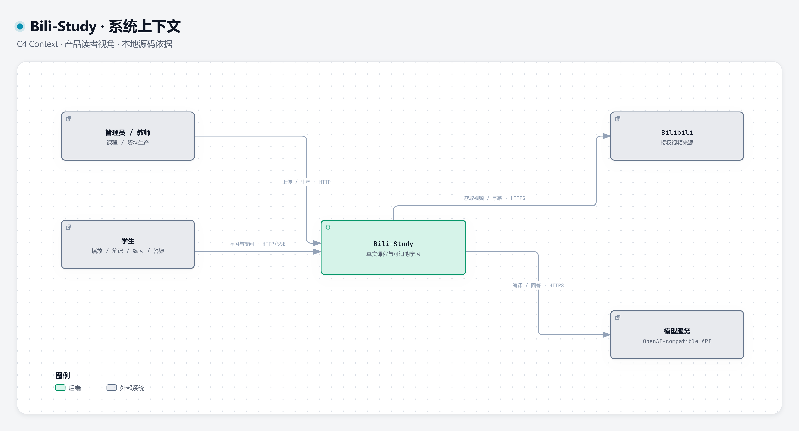

# 架构图与生产流程

这些图依据当前源码职责绘制。箭头是静态架构关系，不是请求已执行的证明。运行实证见 [PDF 学生闭环](../DEMO.md)。

## 系统上下文

[交互 HTML](context.html) · [可编辑 JSON](context.json) · [PNG](context.png)

## 服务与存储

[交互 HTML](containers.html) · [可编辑 JSON](containers.json) · [PNG](containers.png)

这张图完整列出职责关系，连线较密；可在交互图中查找和选中节点查看上下游。LangGraph / Harness / 视频 worker 是 API 内模块。Redis 队列名称为 `parser_jobs`、`ingest_jobs`；详细 C4 图把队列与 Context 缓存分别建模。

## 视频知识生产与正式可见性

[交互 HTML](video-production.html) · [可编辑 JSON](video-production.json) · [PNG](video-production.png)

转写或获取阶段也可能失败，重试按任务实际失败阶段恢复；图中回到 RAG 的重试只适用于产物已经封存的入库失败。原视频独立播放，新版 Pending / Failed 时旧 READY 不失效。

交互图是自包含 HTML，可下载后在本地浏览器打开，支持主题、节点查找与静态路径探索。GitHub 文件页不会直接运行 HTML，目前没有承诺在线托管演示。

C4 原生语义文件：[上下文](c4-context.md)、[容器](c4-containers.md)。
