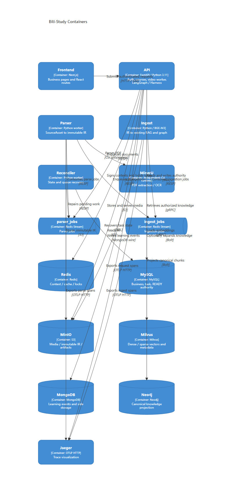

# 服务与存储 · C4

[Mermaid C4 源码](c4-containers.mmd) · [SVG](c4-containers.svg) · [PNG](c4-containers.png)

采用 Context / Container 层级。容器表示可独立运行的应用、worker、CLI 环境或存储，不把 LangGraph 和 Harness 画成额外服务。外部 Bilibili 和模型服务在上下文图出现；具体协议与持久化职责在容器图展开。
